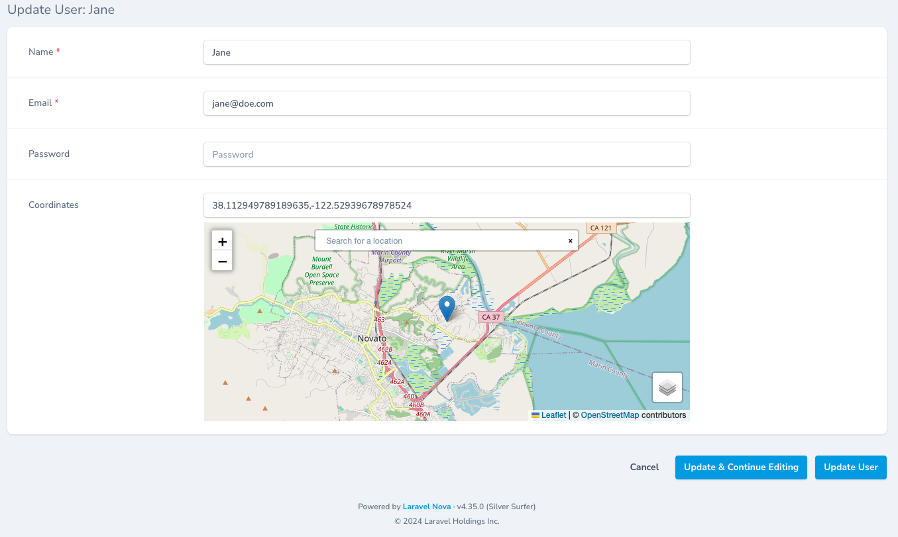
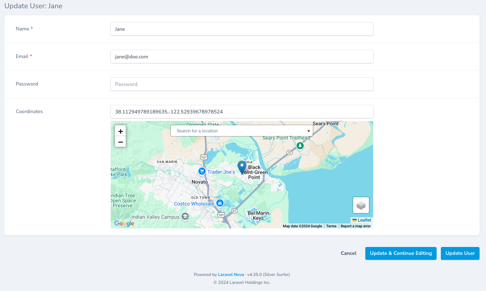
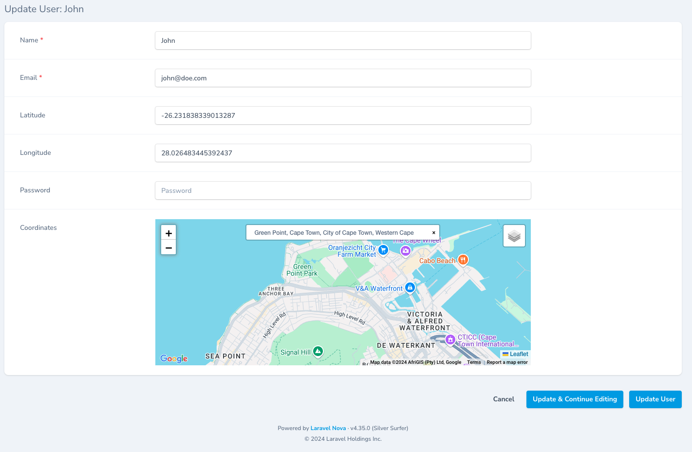
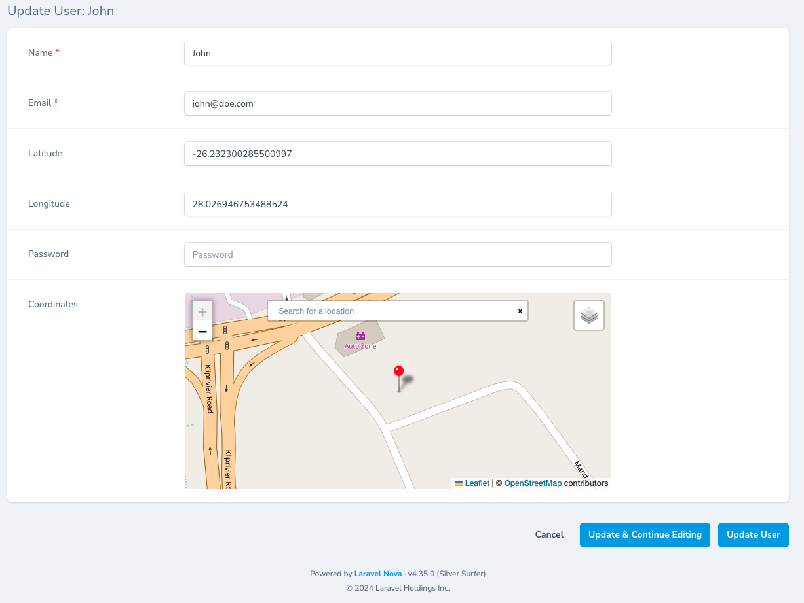

# Nova4MapCoordinates
Custom [Laravel Nova 4](https://nova.laravel.com/) form field for create and update using [Leaflet](https://leafletjs.com/) to retrieve coordinates from a marker. Supports Search, Google Maps, map height, marker popup and custom marker icons.



### Installation

```
composer require imumz/nova-4-map-coordinates
```
### Usage

```
use Imumz\Nova4MapCoordinates\Nova4MapCoordinates
...
Nova4MapCoordinates::make('Map View')

```
### Available Methods

#### Height
```
Nova4MapCoordinates::make('Map View')
->height('400px') // default is 300px
```
#### Google Maps



By default the provider is OpenStreetMaps.<br> 
You must set your Google Maps API key (https://developers.google.com/maps/documentation/javascript/get-api-key).
```
Nova4MapCoordinates::make('Map View')
->googleApiKey('')
->googleMapType('roadmap'), // roadmap, satellite or hybrid
```
#### Default Tile Provider
```
Nova4MapCoordinates::make('Map View')
->defaultTileProvider('google') // google, openstreetmap
```
#### Default Latitude and Longitude
```
Nova4MapCoordinates::make('Map View')
->defaultLatitude()
->defaultLongitude()
```
#### Zoom
Set the zoom level. Default is 8.
```
Nova4MapCoordinates::make('Map View')
->zoom(12)
```
#### Field Names 
Setting the latitude and longitude results from the map marker.
```
Nova4MapCoordinates::make('Map View')
->latitude('my_latitude_field_name')
->longitude('my_longitude_field_name')
```
#### Search 
The search provider is a work in progress. Default is ESRI.



#### Custom Marker Icon
```
Nova4MapCoordinates::make('Map View')
->markerIcon('/images/marker-icon.png')
```
You can pass additional parameters to set the icon size and anchor
```
->markerIcon('/images/marker-icon.png',[100,100],[50,50])
```



